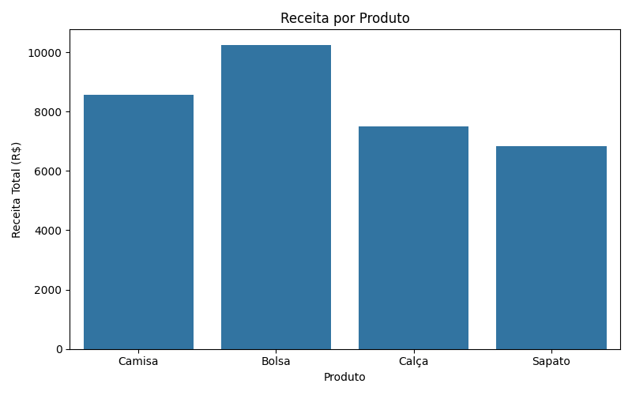

# 🛍️ Análise de Vendas de uma Loja Fictícia

Este projeto simula e analisa as vendas de uma loja fictícia utilizando Python. Ele gera uma base de dados aleatória com informações de vendas e realiza análises descritivas e visuais.

## 📦 Estrutura dos dados

- **Data**: Data da venda
- **Produto**: Tipo de produto vendido
- **Quantidade**: Quantidade vendida
- **Preço Unitário**: Preço por unidade
- **Total**: Receita da venda (Quantidade x Preço)

## 📊 Análises realizadas

- Estatísticas descritivas
- Produto mais vendido
- Receita total por produto
- Visualização gráfica da receita por produto

## 🖼️ Exemplo de gráfico gerado



## 🚀 Como executar

1. Clone o repositório:
```bash
git clone https://github.com/seuusuario/analise-vendas-loja.git
cd analise-vendas-loja
```

2. Execute o script:
```bash
python codigo/analise_vendas.py
```

## 🧪 Requisitos

- Python 3.x
- Pandas
- NumPy
- Matplotlib
- Seaborn
